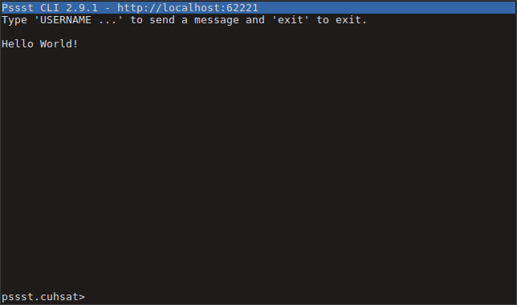

Pssst Chat
==========
A simple `ncurses` based chat for [Pssst](https://github.com/cuhsat/pssst).



Usage
-----
```
$ pssst-chat [option|username|~]
```

Options
-------
* `-h` Shows the usage
* `-l` Shows the license
* `-v` Shows thw version

License
-------
Released under the terms of the [GPLv3](LICENSE) license.
